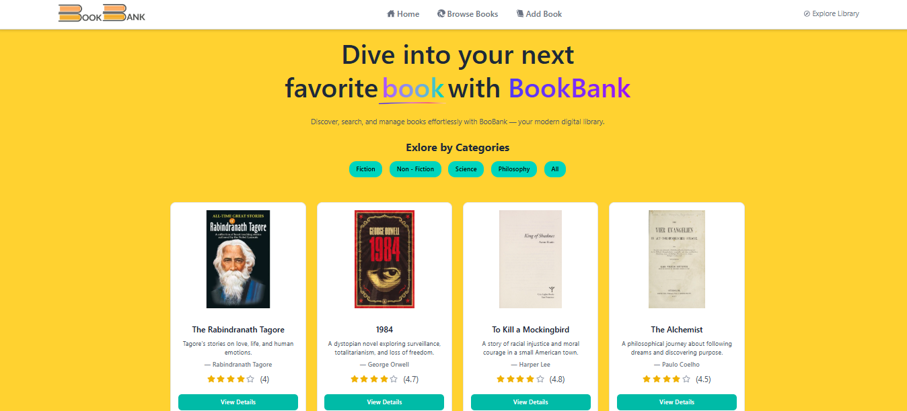

# BookBank

BookBank is a React + Vite app for browsing, searching, and viewing book details. It includes category filtering, simple search over title/author, and support for user-added books persisted in Redux state.

## Features
- Browse by category (sidebar and header links)
- Search by title or author (filters both catalog and added books)
- View book details with rating and rich descriptions
- Add your own books (stored in Redux state, shown in Added Books)
- Responsive grid layout for cards and detail pages
- Error boundary page for unknown routes

## Tech Stack
- React 19 + Vite
- Tailwind CSS v4
- Redux Toolkit for user-added books
- React Router for routing
- Lucide/react-icons for UI icons

## Getting Started
Prerequisites: Node.js 18+ and npm.

```bash
npm install
npm run dev   # start dev server (default http://localhost:5173)
npm run build # production build
```

## Key Routes
- `/` — landing with featured categories
- `/books` — browse all books with search
- `/books/:catagory` — browse by category
- `/books/:catagory/:id` — book detail page
- `/books/added-books` — user-added books
- `/add-book` — add a new book

## Project Structure (high level)
- `src/main.jsx` — router setup and route definitions
- `src/App.jsx` — app shell
- `src/pages/` — top-level pages
  - `BrowseBooks.jsx` — search, filtering, listing
  - `AddedBooks.jsx` — user-added books
- `src/components/` — shared UI
  - `BookList.jsx` — responsive grid renderer
  - `BookCard.jsx` — individual book card
  - `BookDesc.jsx` — book detail view
  - `AddBook.jsx` — add-book form
  - `Header.jsx`, `Footer.jsx`, `SideBar.jsx` — layout chrome
- `src/utils/` — data and store
  - `BooksData.js` — seed catalog data
  - `appStore.js`, `bookSlice.js` — Redux store and slice

## Notes
- The app uses the spelling `catagory` in data/props for compatibility with existing records.
- User-added books live only in Redux state (no backend).
- Tailwind classes are used directly; no separate CSS framework config is required beyond Tailwind v4 defaults.

## Routes
- `/` — landing with featured categories
- `/books` — browse all books with search
- `/books/:catagory` — browse by category
- `/books/:catagory/:id` — book detail page
- `/books/added-books` — user-added books
- `/add-book` — add a new book

## Author
Developed by **GAUTAM VAISHNAV**

## Github link :- 
https://github.com/gautam-vaishnav016/BookBank

## Project Layout Screenshot
## 📸 Preview

